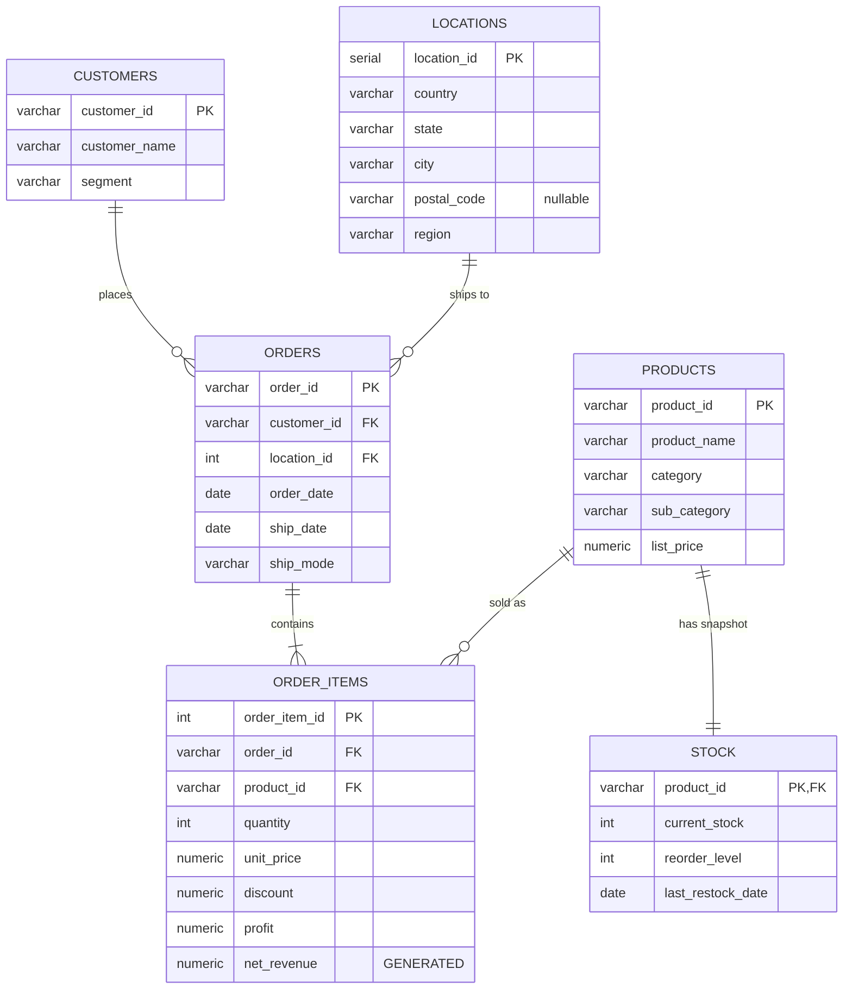
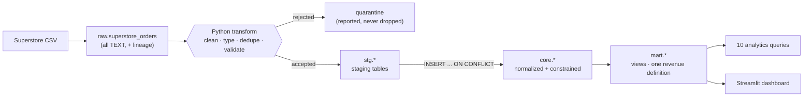

# Schema & ER Diagram

GitHub renders Mermaid natively, so this diagram stays in sync with the repo
instead of drifting away from a PNG someone exported once and never updated.

## Entity relationships (`core` schema)

## Layer flow

---

## Design decisions worth defending

| Decision | Why | The alternative, and what it costs |
|---|---|---|
| `customer_id VARCHAR`, not `INT` | Superstore IDs look like `CG-12520` | `INT` either errors on load or truncates the key |
| Geography on `orders`, not `customers` | A customer ships to several cities across the dataset | Region on `customers` picks one city arbitrarily and quietly corrupts every regional revenue figure |
| `net_revenue` as a `GENERATED` column | One definition of revenue, enforced by the database | Repeating the arithmetic per query — until one query forgets the discount and two reports stop tying out |
| `UNIQUE NULLS NOT DISTINCT` on locations | Postal code is genuinely missing for some rows | Default `UNIQUE` treats each `NULL` as distinct, so every ETL run inserts fresh duplicate locations |
| Surrogate `location_id`, natural keys elsewhere | Location has no stable natural key; the others do | A composite natural key on four nullable columns in every `orders` row |
| `unit_price NUMERIC(12,4)` | It is derived by division, so 2dp drifts | At 2dp, `SUM(net_revenue)` no longer reconciles to `SUM(sales)` |
| Raw layer typed as all `TEXT` | A malformed value can never abort the load | A typed landing table fails before it can tell you what was wrong |
| `stock` is synthetic, and labelled everywhere | Superstore has no inventory column, but Q05 needs one | Presenting generated data as sourced — the fastest way to lose credibility |

## Exporting a PNG (optional)

Some recruiters skim the repo outside GitHub. If you want a static image:

1. Paste the `erDiagram` block into <https://mermaid.live>
2. Export PNG → save as `docs/er_diagram.png`
3. Reference it in the README alongside the Mermaid block
